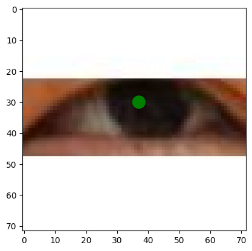

# Pupil Center Regression 👁️

> **Project Submission**
>
> **Subject:** Deep Learning / Computer Vision

A computer vision project aimed at detecting and regressing the precise coordinates $(x, y)$ of the pupil center within eye images using Deep Learning techniques. This project demonstrates the end-to-end pipeline from data extraction to model training using **TensorFlow/Keras**.

##  Project Overview

Locating the pupil center is a crucial task in gaze tracking, biometrics, and medical diagnosis (e.g., Strabismus screening). This notebook implements a regression model that takes an eye image as input and outputs the coordinate of the pupil center.

**Key Objective:** To develop a robust deep learning model capable of accurately predicting pupil location under various conditions.

##  Key Features

* **Automated Data Pipeline:** Scripts to automatically handle and extract dataset archives (`.zip`), mapping images to their corresponding annotation text files.
* **Data Preprocessing:**
    * Parsing coordinate annotations from text files.
    * Resizing high-resolution eye images to a standard input size (224x224).
    * Data normalization for optimal model convergence.
* **Transfer Learning Architecture:** Utilizes state-of-the-art pre-trained architectures (imported libraries include **MobileNetV2**, **ResNet50**, and **Xception**) to leverage feature extraction capabilities.
* **Regression Output:** Customized final layers designed to output continuous values representing the $(x, y)$ coordinates.

##  Tech Stack

* **Language:** Python
* **Framework:** TensorFlow, Keras
* **Data Processing:** NumPy, Pandas, PIL (Python Imaging Library), OpenCV
* **Visualization:** Matplotlib
* **Environment:** Jupyter Notebook / Google Colab

##  Dataset Structure

The project processes a custom dataset organized as follows:

* **Images:** `*.jpg` files containing cropped eye images.
* **Annotations:** `*.txt` files containing the ground truth coordinates.
    * *Format:* Each text file corresponds to an image filename and contains space-separated float values `x y`.

##  Workflow

1.  **Data Extraction:**
    The notebook automatically unzips `ImageRight.zip` and `AnnotationsRight.zip` into structured directories.

2.  **Preprocessing & Matching:**
    * Iterates through the image directory.
    * Matches each image with its annotation file based on filename.
    * Filters out samples with missing annotations.

3.  **Model Training:**
    * Input: $(224, 224, 3)$ RGB Images.
    * Backbone: Transfer learning (MobileNetV2/ResNet50).
    * Head: Dense layers for regression.
    * Loss Function: Mean Squared Error (MSE) or similar regression metrics.

## 💻 Getting Started

### Prerequisites
* Python 3.x
* TensorFlow 2.x
* Jupyter Notebook

### Installation

1.  **Clone the repository**
    ```bash
    git clone [https://github.com/ScenerYOne/Deep-Learning.git](https://github.com/ScenerYOne/Deep-Learning.git)
    ```

2.  **Install dependencies**
    ```bash
    pip install tensorflow numpy matplotlib pillow opencv-python
    ```

3.  **Prepare Data**
    * Place `ImageRight.zip` and `AnnotationsRight.zip` in the project root or update the paths in the notebook variables:
        ```python
        image_file = 'path/to/ImageRight.zip'
        annotation_file = 'path/to/AnnotationsRight.zip'
        ```

4.  **Run the Notebook**
    Open `Pupil.ipynb` and execute the cells sequentially.

##  Results

| Input Image | Ground Truth | Prediction |
| :---: | :---: | :---: |
|  | (x, y) | (x, y) |

---


---
*This project was developed as part of the Deep Learning curriculum.*
